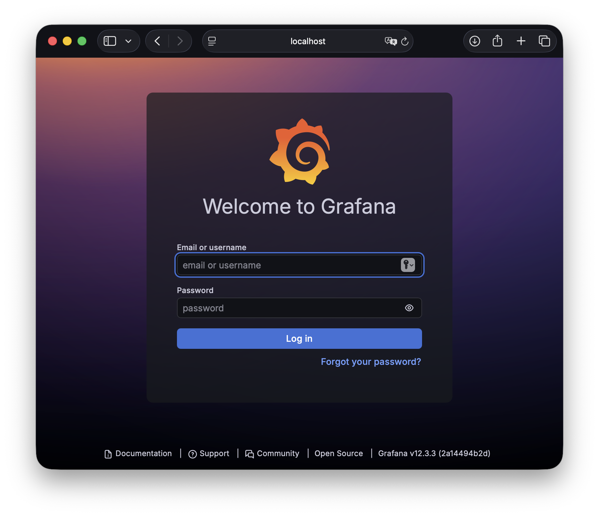
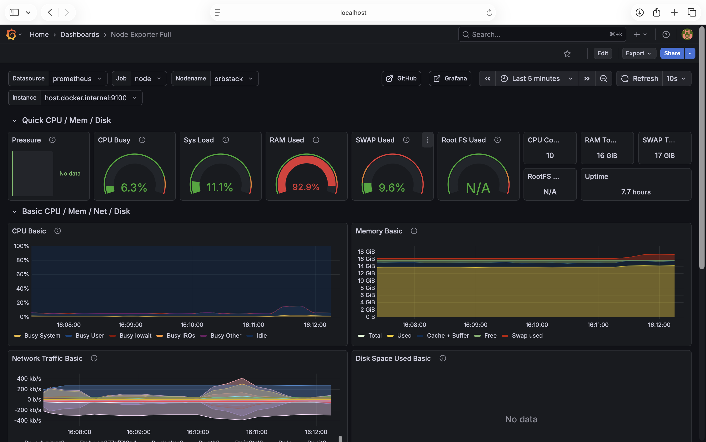
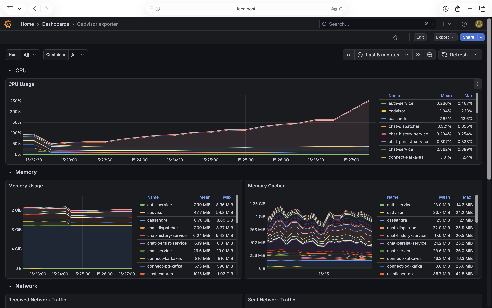
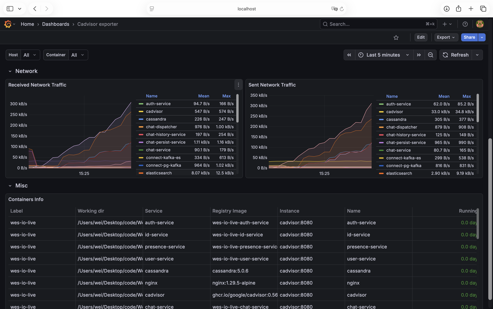

<div align="center">

# Wes-IO-Live

**A Real-Time Live Streaming Platform with Microservice Architecture** · WebRTC Push · HLS Playback · S3 VOD

[](https://go.dev/)
[](./LICENSE)
[](https://webrtc.org/)
[](https://developer.apple.com/documentation/http_live_streaming)
[](https://www.docker.com/)
[](https://aws.amazon.com/s3/)

---

[📖 中文](README.zh.md) · [📖 English](README.md)

[](https://github.com/weiawesome/Wes-IO-Live)
[](https://github.com/weiawesome/Wes-IO-Live)

</div>

---

## ✨ Features

| Capability | Description |
|------------|-------------|
| **WebRTC Push**       | Direct streaming from browser, ultra-low latency, no plugin required |
| **HLS Live Playback** | HLS.js player for viewers, high compatibility |
| **S3 / MinIO VOD**    | HLS automatically uploads to S3 after live ends, supports playback |
| **Microservice Architecture** | Auth / User / Room / Signal / Media / Chat are separated for scalability |
| **Real-time Chat**    | WebSocket chat + Kafka + Cassandra message persistence |
| **STUN/TURN**         | ICE service for NAT traversal/relay, handles complex network scenarios |
| **Logging Monitoring** | Elasticsearch, Fluentd, Kibana |
| **Performance Monitoring** | Node Exporter, Cadvisor, Prometheus, Grafana |
| **Search**            | CDC + Elasticsearch |

---

## 🏗 Architecture Overview

All requests go through Nginx as a single entry point. Each microservice handles authentication, room management, signaling, media, playback, and chat. The stack uses PostgreSQL, Redis, MinIO/S3, Cassandra, and Kafka.


> In the diagram: **Nginx** acts as the API Gateway/static and WebSocket proxy; **User / Room / Signal / ICE / Playback / Chat** are business/signaling services; **Media Service** handles WebRTC ingest, FFmpeg-to-HLS conversion, S3 upload; **Auth** provides JWT via gRPC; storage relies on **PostgreSQL**, **Redis**, **MinIO/S3**, and **Cassandra**.

---

## Demo

1. **Register / Sign in**

   

2. **Create Room**

   

3. **Start Live Stream**

   

4. **Watch Live (multi-device)**

   

5. **Watch VOD after Live Ends**

   

---

## Quick Start

```bash
docker-compose up -d
```

**After startup, complete the following manually:**

1. **MinIO: Create bucket and set permissions, event notifications, and lifecycle**  
   ```bash
   docker exec -i minio bash < minio/bucket_settings.sh
   ```
   This will create `users`, `users-processed`, and `vod` buckets, and set the corresponding permissions.
   And create event notification to send `put` events from `users` bucket to `minio-events` topic.
   And create bucket lifecycle rule: `delete-pending` objects are deleted after 7 days.
   
2. **Cassandra: Create chat Keyspace and Table**  
   In the project root, run:
   ```bash
   docker exec -i cassandra cqlsh < chat-persist-service/migrations/001_create_tables.cql
   ```
   Or enter the container and manually paste/run the content of [001_create_tables.cql](chat-persist-service/migrations/001_create_tables.cql) in `cqlsh` to create the `wes_chat` keyspace and `messages_by_room_session` table:
   ```bash
   docker exec -it cassandra cqlsh
   ```

   Start the services that depend on Cassandra:
   ```bash
   docker-compose up -d chat-history-service chat-persist-service
   ```
3. **CDC: Create Kafka Topics and Connectors**
   1. Create Topics in kafka (Source)
   ```bash
   docker exec -it kafka kafka-topics --bootstrap-server kafka:9092 \
      --create --topic connect-configs-pg-kafka \
      --partitions 1 --replication-factor 1 \
      --config cleanup.policy=compact

   docker exec -it kafka kafka-topics --bootstrap-server kafka:9092 \
      --create --topic connect-offsets-pg-kafka \
      --partitions 1 --replication-factor 1 \
      --config cleanup.policy=compact

   docker exec -it kafka kafka-topics --bootstrap-server kafka:9092 \
      --create --topic connect-status-pg-kafka \
      --partitions 1 --replication-factor 1 \
      --config cleanup.policy=compact
   ```
   2. Create CDC connectors (Source)
   ```shell
   # Start connect-pg-kafka container
   docker-compose up -d connect-pg-kafka

   # Create CDC connector (users)
   curl -X POST -H "Content-Type: application/json" \
      -d @connect/pg-kafka/source_users.json http://localhost:9083/connectors

   # Create CDC connector (rooms)
   curl -X POST -H "Content-Type: application/json" \
      -d @connect/pg-kafka/source_rooms.json http://localhost:9083/connectors
   ```
   3. Create Topics in kafka (Sink)
   ```shell
   docker exec -it kafka kafka-topics --bootstrap-server kafka:9092 \
      --create --topic connect-configs-kafka-es \
      --partitions 1 --replication-factor 1 \
      --config cleanup.policy=compact

   docker exec -it kafka kafka-topics --bootstrap-server kafka:9092 \
      --create --topic connect-offsets-kafka-es \
      --partitions 1 --replication-factor 1 \
      --config cleanup.policy=compact

   docker exec -it kafka kafka-topics --bootstrap-server kafka:9092 \
      --create --topic connect-status-kafka-es \
      --partitions 1 --replication-factor 1 \
      --config cleanup.policy=compact

   docker exec -it kafka kafka-topics --bootstrap-server kafka:9092 \
      --create --topic dlq-users \
      --partitions 1 --replication-factor 1 \
      --config cleanup.policy=compact

   docker exec -it kafka kafka-topics --bootstrap-server kafka:9092 \
      --create --topic dlq-rooms \
      --partitions 1 --replication-factor 1 \
      --config cleanup.policy=compact
   ```
   4. Create CDC connectors (Sink)
   ```shell
   # Start connect-kafka-es container
   docker-compose up -d connect-kafka-es

   # Create CDC connector (users)
   curl -X POST -H "Content-Type: application/json" \
      -d @connect/kafka-es/sink_users.json http://localhost:9084/connectors

   # Create CDC connector (rooms)
   curl -X POST -H "Content-Type: application/json" \
      -d @connect/kafka-es/sink_rooms.json http://localhost:9084/connectors
   ```

- **Home:** http://localhost:8080  
- Register / Sign in → Create Room → Start Streaming

---

## 🔍 Monitoring

### Unified Logging Structure [/pkg/log](./pkg/log)
```json
{
  "level":"info",
  "service":"xxx-service",
  "time":"YYYY-MM-DDTHH:MM:SSZ",
  // other custom fields based on specific microservice needs
}
```
Easily parsed by Fluentd and stored in Elasticsearch for monitoring.

### Kibana Dashboard Examples

1. Log Data
   
2. Service Log Count
   
3. Service Action Count (Audit Events)
   
4. Dashboard Example
   

Above are just simple examples, you can adjust them according to your needs.

---

## 📊 Performance Monitoring

### Grafana Dashboard Examples

0. Grafana Dashboard
   
1. Node Exporter ([Template ID: 1860](https://grafana.com/grafana/dashboards/1860-node-exporter-full/))

   

2. Cadvisor ([Template ID: 14282](https://grafana.com/grafana/dashboards/14282-cadvisor-exporter/))

   

   

Above are just simple examples, you can adjust them according to your needs.

---

## 📄 License

[MIT License](./LICENSE) · Copyright (c) 2026 Wes (Tcweeei)
