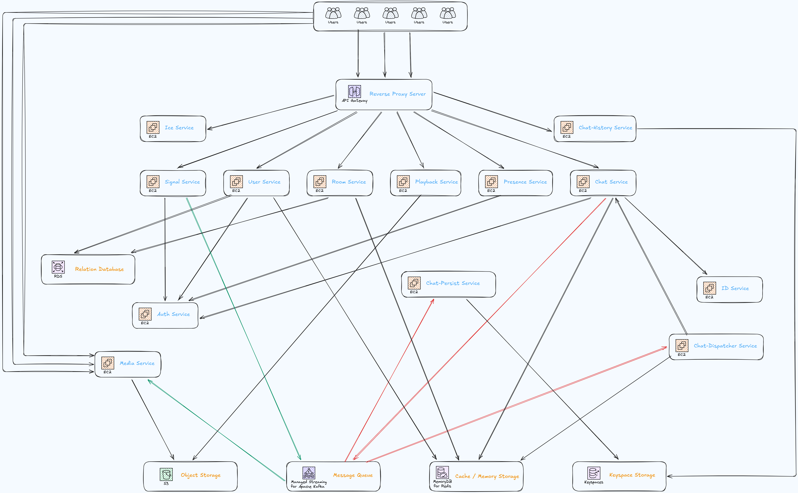
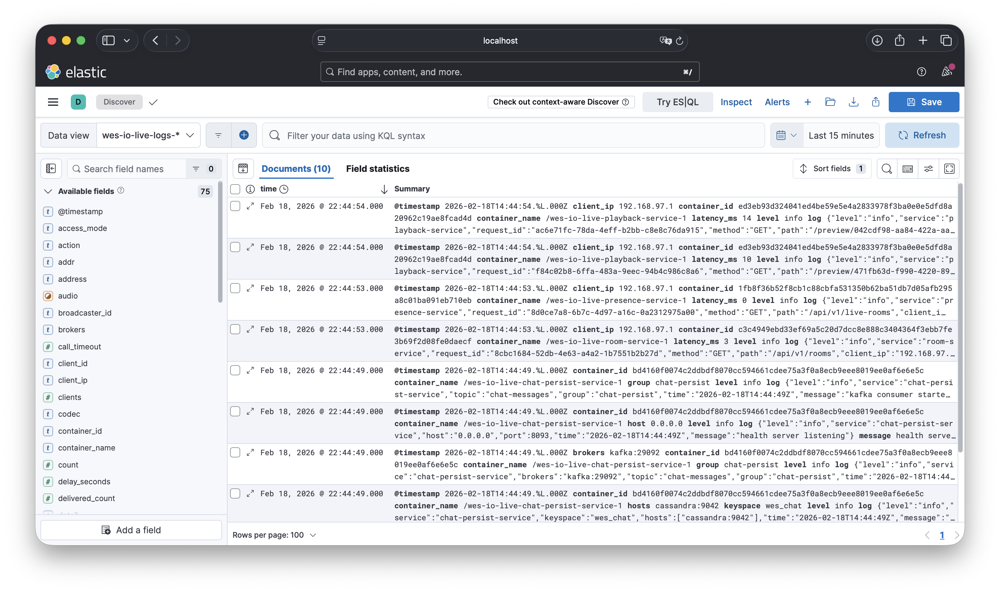
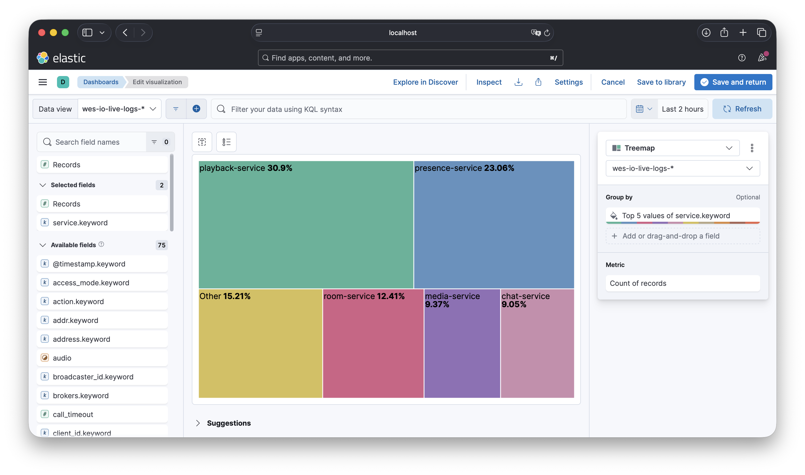
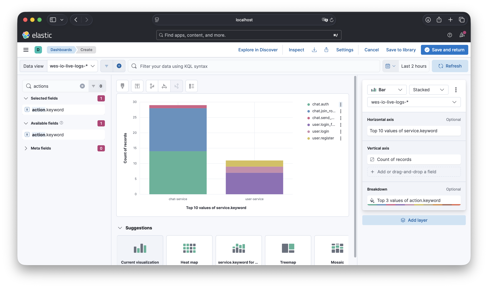
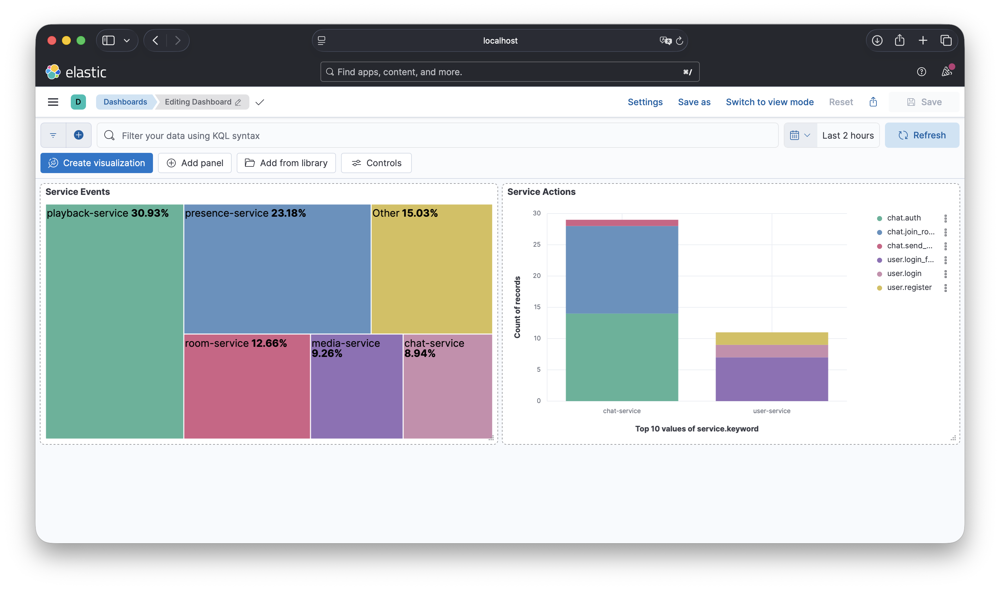

<div align="center">

# Wes-IO-Live

**微服務架構的即時直播平台** · WebRTC 推流 · HLS 播放 · S3 VOD 回放

[](https://go.dev/)
[](./LICENSE)
[](https://webrtc.org/)
[](https://developer.apple.com/documentation/http_live_streaming)
[](https://www.docker.com/)
[](https://aws.amazon.com/s3/)

---

[📖 中文](README.zh.md) · [📖 English](README.md)

[](https://github.com/weiawesome/Wes-IO-Live)
[](https://github.com/weiawesome/Wes-IO-Live)

</div>

---

## ✨ 功能特色

| 能力 | 說明 |
|------|------|
| **WebRTC 推流** | 主播端瀏覽器直推，低延遲、無需插件 |
| **HLS 即時播放** | 觀眾端 HLS.js 播放，相容性佳 |
| **S3 / MinIO VOD** | 直播結束自動上傳 HLS 至 S3，支援回放 |
| **微服務架構** | Auth / User / Room / Signal / Media / Chat 等服務分離，易擴展 |
| **即時聊天** | WebSocket 聊天 + Kafka + Cassandra 歷史存儲 |
| **STUN/TURN** | ICE 服務提供穿透與中繼，適配複雜網路環境 |
| **監控** | Elasticsearch、Fluentd、Kibana |
| **搜索** | CDC + Elasticsearch |

---

## 🏗 軟體架構

整體請求經 Nginx 統一入口，由各微服務處理認證、房間、信令、媒體、播放與聊天，底層依賴 PostgreSQL、Redis、MinIO/S3、Cassandra、Kafka 等。



> 架構圖中：**Nginx** 為 API Gateway / 靜態與 WebSocket 代理；**User / Room / Signal / ICE / Playback / Chat** 等為業務與信令服務；**Media Service** 負責 WebRTC 接收、FFmpeg 轉 HLS、S3 上傳；**Auth** 以 gRPC 提供 JWT；資料存儲為 **PostgreSQL**、**Redis**、**MinIO/S3**、**Cassandra**。

---

## 效果展示

1. **註冊 / 登入**

   

2. **建立房間**

   

3. **開始直播**

   

4. **多端觀看直播**

   

5. **直播結束後回放 VOD**

   

---

## 快速開始

```bash
docker-compose up -d
```

**啟動後需手動完成以下設定：**

1. **MinIO：建立 VOD bucket**  
   在 MinIO 控制台或 CLI 中建立名為 `vod` 的 bucket（用於直播結束後 HLS 回放存儲）。

2. **Cassandra：建立聊天 Keyspace 與表**  
   在專案根目錄執行：
   ```bash
   docker exec -i cassandra cqlsh < chat-persist-service/migrations/001_create_tables.cql
   ```
   或進入容器後在 `cqlsh` 中手動貼上並執行 [001_create_tables.cql](chat-persist-service/migrations/001_create_tables.cql) 的內容（建立 `wes_chat` keyspace 與 `messages_by_room_session` 表）：
   ```bash
   docker exec -it cassandra cqlsh
   ```

   啟動依賴 Cassandra 的服務：
   ```bash
   docker-compose up -d chat-history-service chat-persist-service
   ```

3. **CDC：建立 Kafka Topics 與連接器**
   1. 建立 Topics in kafka (Source)
   ```bash
   docker exec -it kafka kafka-topics --bootstrap-server kafka:9092 \
      --create --topic connect-configs-pg-kafka \
      --partitions 1 --replication-factor 1 \
      --config cleanup.policy=compact

   docker exec -it kafka kafka-topics --bootstrap-server kafka:9092 \
      --create --topic connect-offsets-pg-kafka \
      --partitions 1 --replication-factor 1 \
      --config cleanup.policy=compact

   docker exec -it kafka kafka-topics --bootstrap-server kafka:9092 \
      --create --topic connect-status-pg-kafka \
      --partitions 1 --replication-factor 1 \
      --config cleanup.policy=compact
   ```
   2. 建立 CDC 連接器 (Source)
   ```shell
   # 啟動 connect-pg-kafka 容器
   docker-compose up -d connect-pg-kafka

   # 建立 CDC 連接器 (users)
   curl -X POST -H "Content-Type: application/json" \
      -d @connect/pg-kafka/source_users.json http://localhost:9083/connectors

   # 建立 CDC 連接器 (rooms)
   curl -X POST -H "Content-Type: application/json" \
      -d @connect/pg-kafka/source_rooms.json http://localhost:9083/connectors
   ```
   3. 建立 Topics in kafka (Sink)
   ```shell
   docker exec -it kafka kafka-topics --bootstrap-server kafka:9092 \
      --create --topic connect-configs-kafka-es \
      --partitions 1 --replication-factor 1 \
      --config cleanup.policy=compact

   docker exec -it kafka kafka-topics --bootstrap-server kafka:9092 \
      --create --topic connect-offsets-kafka-es \
      --partitions 1 --replication-factor 1 \
      --config cleanup.policy=compact

   docker exec -it kafka kafka-topics --bootstrap-server kafka:9092 \
      --create --topic connect-status-kafka-es \
      --partitions 1 --replication-factor 1 \
      --config cleanup.policy=compact

   docker exec -it kafka kafka-topics --bootstrap-server kafka:9092 \
      --create --topic dlq-users \
      --partitions 1 --replication-factor 1 \
      --config cleanup.policy=compact

   docker exec -it kafka kafka-topics --bootstrap-server kafka:9092 \
      --create --topic dlq-rooms \
      --partitions 1 --replication-factor 1 \
      --config cleanup.policy=compact
   ```
   4. 建立 CDC 連接器 (Sink)
   ```shell
   # 啟動 connect-kafka-es 容器
   docker-compose up -d connect-kafka-es

   # 建立 CDC 連接器 (users)
   curl -X POST -H "Content-Type: application/json" \
      -d @connect/kafka-es/sink_users.json http://localhost:9084/connectors
   
   # 建立 CDC 連接器 (rooms)
   curl -X POST -H "Content-Type: application/json" \
      -d @connect/kafka-es/sink_rooms.json http://localhost:9084/connectors
   ```

- **主頁**：http://localhost:8080  
- 登入/註冊 → 建立房間 → 開始直播

---
## 🔍 監控

### 統一結構日誌設計 [/pkg/log](./pkg/log)

   ```json
   {
      "level":"info",
      "service":"xxx-service",
      "time":"YYYY-MM-DDTHH:MM:SSZ",
      // 其他自定義字段 根據不同微服務需求而定
   }
   ```
   方便於 Fluentd 統一解析，並存儲到 Elasticsearch。

### Kibana 圖表範例

1. 日誌數據
   
2. 微服務內日誌數量
   
3. 微服務內操作量 (稽核事件)
   
4. 看板範例
   

以上僅是簡單的範例，實際使用時可以根據需要進行調整。

---

## 📄 授權

[MIT License](./LICENSE) · Copyright (c) 2026 Wes (Tcweeei)
